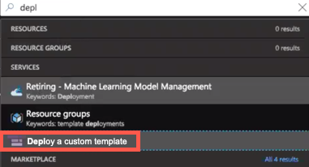
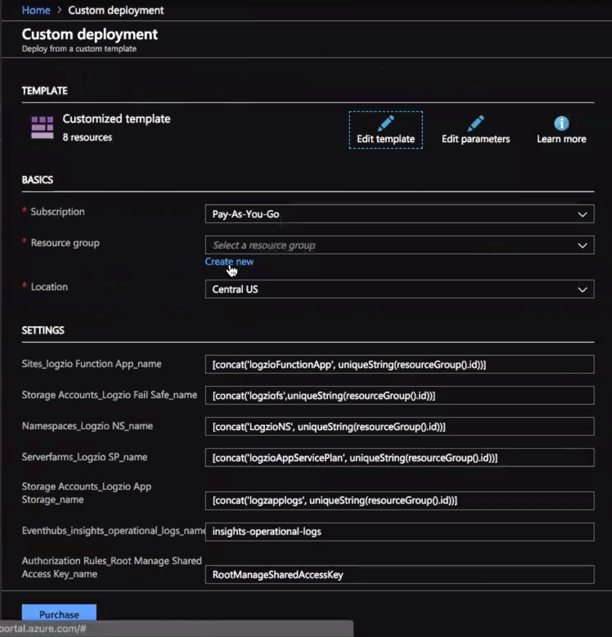
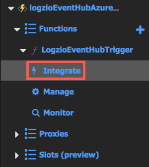
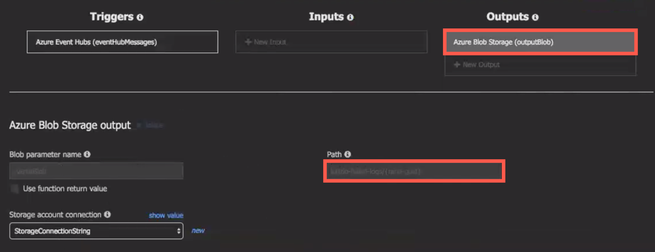

# logzio-azure-serverless
This repo contains the code and instructions you'll need to ship logs from your Azure services to Logz.io.
At the end of this process, your Azure function will forward logs from an Azure Event Hub to your Logz.io account.

## Before you start

To get everything up and running, you'll need:

* An event hub that will receive logs
  ([instructions](https://docs.microsoft.com/en-us/azure/event-hubs/event-hubs-create)). Name this event hub "insights-operational-logs" (this is the default name used by Azure Monitor).
* A shared access policy for the insights-operational-logs event hub.
  This shared access policy should have **Manage** access and should be called "logging-policy".
* A new consumer group in the insights-operational-logs event hub called "logzio-consumer-group".
* Logs streaming from your Azure services to the insights-operational-logs event hub
  ([instructions](https://docs.microsoft.com/en-us/azure/monitoring-and-diagnostics/monitor-stream-monitoring-data-event-hubs)).

You'll need the region—so keep this information handy!

## Setting log shipping from Azure

### 1. Deploy a custom template

In the search bar, type "deploy", and then click **Deploy a custom template**.
This brings you to the _Custom deployment_ page.

Click **Build your own template in the editor** to continue to the template editor.
Clear the default code so the editor is blank.
Replace it with the code from [logzio-azure-serverless](https://raw.githubusercontent.com/logzio/logzio-azure-serverless/master/azuredeploy.json), and then click **Save** to continue to the _Customized template_ page.

### 2. Configure the customized template

In the **BASICS** section:
* **Resource group**: Click **Create new**.  
  Type the **Name** "logzioEventHubIntegration", and then click **OK**.
* **Location**: Choose the same region as the Event Hub you'll collect logs from.

In the **SETTINGS** section:
* **Logzio Host**: Use your Logz.io region's listener URL.
  If your login URL is app.logz.io, use `listener.logz.io` (this is the default setting).
  If your login URL is app-eu.logz.io, use `listener-eu.logz.io`.
* **Logzio Token**: Use the [token](https://app.logz.io/#/dashboard/settings/general) of the account you want to ship to.
* **Authorization Rules_Root Manage Shared Access Key_name**: Set to "logging-policy", as discussed in Before You Start (above).
* **Consumergroups_$Default_name**: Set to "logzio-consumer-group".

At the bottom of the page, select **I agree to the terms and conditions stated above**, and then click **Purchase**.

The new function app will deploy.
Deployment can take a few minutes.

### 3. _(Optional)_ Add failsafe for log shipping timeouts

You can configure logzio-azure-serverless to back up logs to Azure Blob Storage.
This prevents dropped logs if the connection to Logz.io times out.

To do this, expand your function app's left menu, and then click **Integrate**.

In the top of the triggers panel, click **Azure Blob Storage (outputBlob)**.
The _Azure Blob Storage output_ settings are displayed.

Leave **Blob parameter name** blank.
Enter the blob **Path** for the Azure blob you're sending dropped logs to, and then click **Save**.

**Important:** Make sure the blob **Path** you're using here exists or create it now.

**Note:** For more information on Azure Blob output binding, see [Azure Blob storage bindings for Azure Functions > Output](https://docs.microsoft.com/en-us/azure/azure-functions/functions-bindings-storage-blob#output) from Microsoft.

### 4. Test your configuration

In the right of the window, click **Test** to show the _Test_ panel, and then click **Run**.

If you experience any errors in Azure, it may be that the logzio-nodejs wasn't fully loaded by the app.
You can fix this by clicking your app in the function app's left menu and then clicking **Restart** in the _Overview_ tab.
After the function app restarts, run the test another time by click **Run** in the _Test_ panel.

**Note**: If you need more information on dependency management, see [Azure Functions JavaScript developer guide](https://docs.microsoft.com/en-us/azure/azure-functions/functions-reference-node#dependency-management) from Microsoft.

Give your logs some time to get from your system to ours, and then open Kibana.
If everything went according to plan, you should see logs with the type `eventhub` in Kibana.

If you still don’t see your logs, see [log shipping troubleshooting](https://docs.logz.io/user-guide/log-shipping/log-shipping-troubleshooting.html) in the Logz.io docs.
