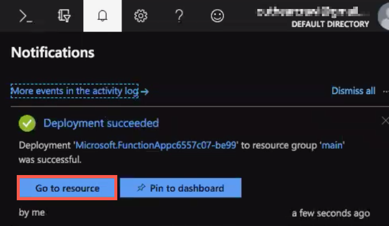
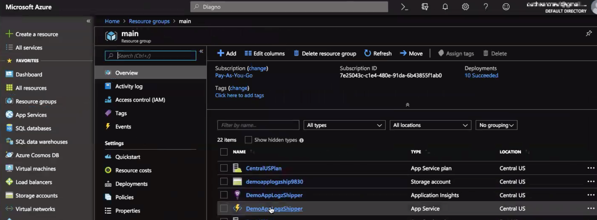
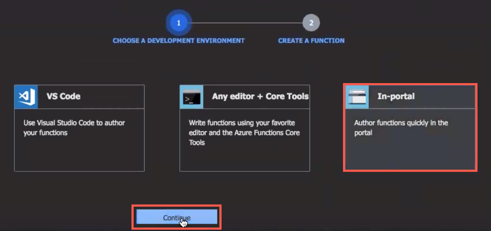
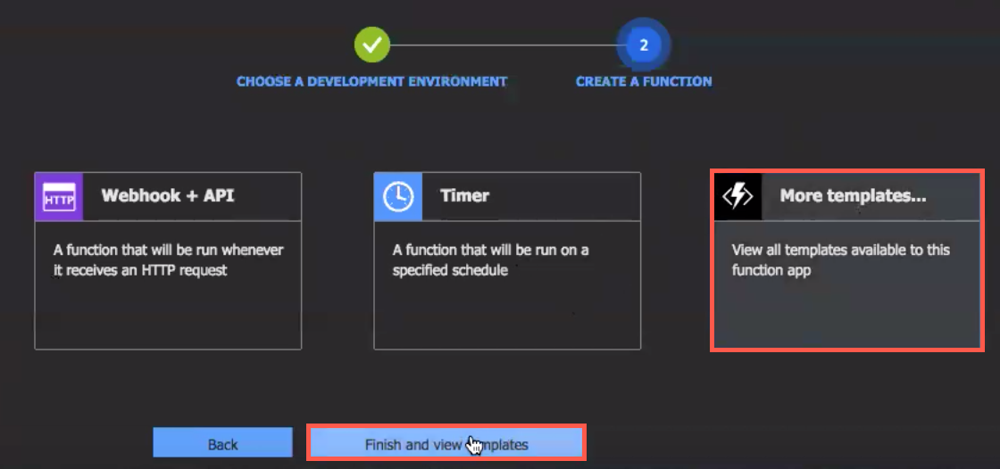
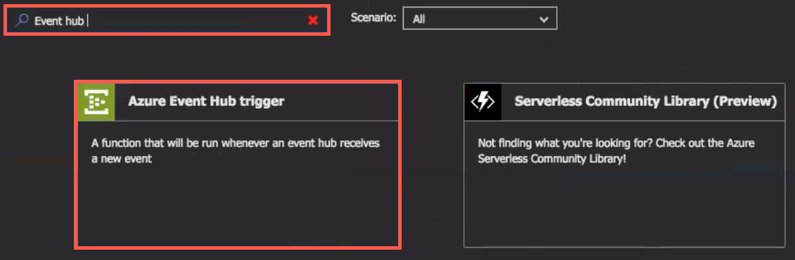
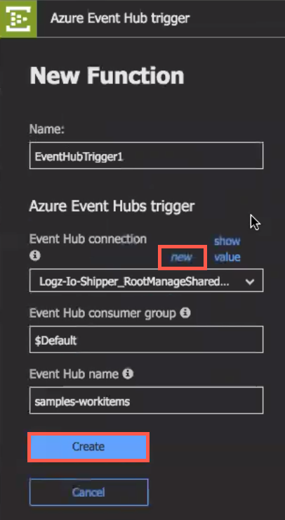
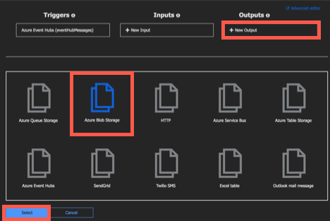

# logzio-azure-serverless
This repo contains the code and instructions you'll need to ship logs from your Azure services to Logz.io.
At the end of this process, your Azure function will forward logs from an Azure Event Hub to your Logz.io account.

## Before you start

To get everything up and running, you'll need to have these things ready before you start:

You'll need:
* An Event Hub that will receive logs
  ([instructions](https://docs.microsoft.com/en-us/azure/event-hubs/))
* Logs streaming from your Azure services to the Event Hub
  ([instructions](https://docs.microsoft.com/en-us/azure/monitoring-and-diagnostics/monitor-stream-monitoring-data-event-hubs))

In step 1 of the setup, you'll need the Event Hub name, resource group, and region—so keep this information handy!

## Setting log shipping from Azure

### 1. Create a new Azure function app

**Note**: If you need more help setting up a function app, see [Azure Functions Documentation](https://docs.microsoft.com/en-us/azure/azure-functions/) from Microsoft.

In the left menu of the Azure Portal, click **Create a resource**, then select **Compute > Function App**.
Click **Create** (bottom of the panel) to continue to the _Function App_ panel.

Use these settings (set the other values to whatever makes sense for your environment):
* **Resource Group**: Click **Use existing**, and then choose the resource group that contains the Event Hub you'll collect logs from
* **Runtime Stack**: Choose **JavaScript**
* **Location**: Choose the same region as the Event Hub you'll collect logs from

Click **Create** to deploy the new function app. This may take a few minutes.



Wait until the deployment is complete to continue.

### 2. Create a new function in the function app

In the left menu, click **Resource groups**, then click the resource group that you just deployed to.



Click the function app you just deployed.
In the function app's left menu, click **+** (next to **Functions**) to add a new function.
This takes you to the Quickstart tab.



Click **In-portal**, and then click **Continue**.



Click **More templates...**, and then click **Finish and view templates** to continue.



In the search box, type "event hub", and then click **Azure Event Hub Trigger**.
The _New Function_ panel opens.



Above the **Event Hub connection** list, click **new**.
In the _Connection_ dialog box, select the **Event Hub** tab, then set the options for the Event Hub you'll collect logs from.
Click **Select** to return to the _New Function_ panel.

Leave the other form fields as their default values, and then click **Create**.

### 3. Set up index.js

In the _index.js_ file, replace the default code with the code from [index.js](src/index.js) in logzio-azure-serverless.

Replace `<ACCOUNT-TOKEN>` with the [token](https://app.logz.io/#/dashboard/settings/general) of the account you want to ship to.

Replace `<LISTENER-URL>` with your region's listener URL. If your login URL is app.logz.io, use `listener.logz.io`. If your login URL is app-eu.logz.io, use `listener-eu.logz.io`.

Click **Save**.

### 4. Set up data-parser.js

In the _View files_ panel, click **Add** to add a new file. Name this file `data-parser.js`.

Open _data-parser.js_, paste the code from [data-parser.js](src/data-parser.js) in logzio-azure-serverless, and click **Save**.

### 5. _(Optional)_ Add failsafe for log shipping timeouts

If the connection to Logz.io times out, you can configure logzio-azure-serverless to back up logs to Azure Blob Storage as a failsafe to prevent dropped logs.


To do this, expand your function app's left menu, and then click **Integrate**.



In the top of the triggers panel, click **New Output**, select **Azure Blob Storage**, and then click **Select**.
The _Azure Blob Storage output_ settings are displayed.

Leave **Blob parameter name** as "outputBlob".
Enter the **Path** and **Storage account connection** information for the Azure Blob you're sending dropped logs to, and then click **Save**.

**Note:** For more information on Azure Blob output binding, see [Azure Blob storage bindings for Azure Functions > Output](https://docs.microsoft.com/en-us/azure/azure-functions/functions-bindings-storage-blob#output) from Microsoft.

### 6. Install logzio-nodejs

In the bottom of the window, click **Console** to show the command line, then update npm to the latest version and install logzio-nodejs:

```pwsh
npm i -g npm
npm install logzio-nodejs
```

The logzio-nodejs installation may take a few minutes.
You can confirm the installation is done by clicking **View files** (on the right side of the window) and finding _node_modules > logzio-nodejs_.

### 7. Test your configuration

In the right of the window, click **Test** to show the _Test_ panel, and then click **Run**.

If you experience any errors in Azure, it may be that the logzio-nodejs wasn't fully loaded by the app.
You can fix this by clicking your app in the function app's left menu and then clicking **Restart** in the _Overview_ tab.
After the function app restarts, run the test another time by click **Run** in the _Test_ panel.

**Note**: If you need more information on dependency management, see [Azure Functions JavaScript developer guide](https://docs.microsoft.com/en-us/azure/azure-functions/functions-reference-node#dependency-management) from Microsoft.

Give your logs some time to get from your system to ours, and then open Kibana.
If everything went according to plan, you should see logs with the type `eventhub` in Kibana.

If you still don’t see your logs, see [log shipping troubleshooting](https://docs.logz.io/user-guide/log-shipping/log-shipping-troubleshooting.html) in the Logz.io docs.
