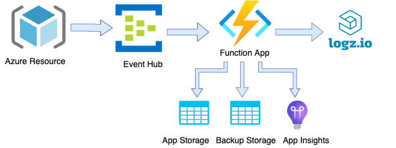
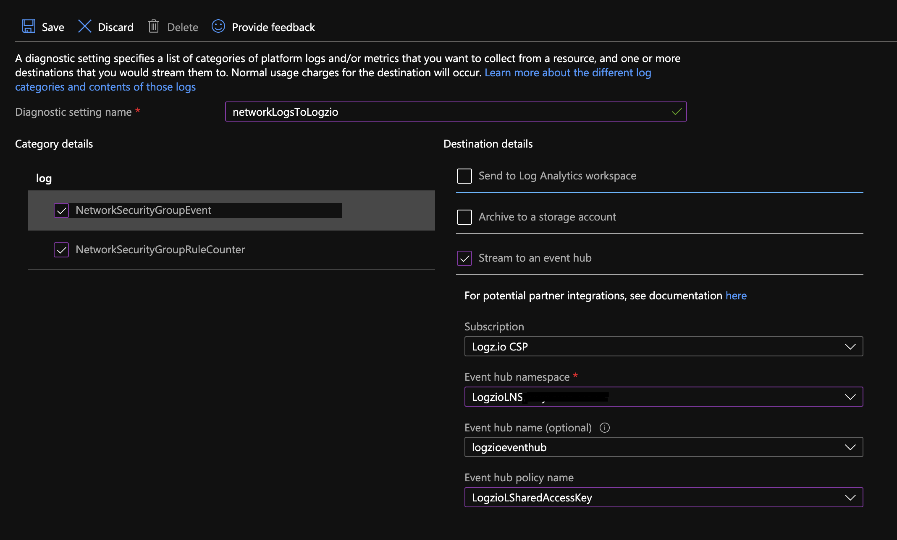
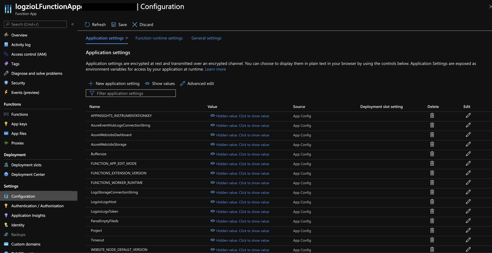

This integration is deprecated and will not receive any further updates. The new integration is available at [azure-serverless](https://github.com/logzio/azure-serverless).

# logzio-azure-serverless
**This project is deprecated as we have transitioned to a new function app for shipping logs from Azure services to Logz.io. Please use [this](https://github.com/logzio/azure-serverless/tree/master) instead.**

This repo contains the code and instructions you'll need to ship logs and metrics from your Azure services to Logz.io.
At the end of this process, your Azure function will forward logs or metrics from an Azure Event Hub to your Logz.io account.

**Note: The metrics solution is deprecated and only works with the elastic-based Logz.io metrics product.**

## Setting log shipping from Azure

### 1. Deploy the Logz.io template👇 

This deployment will create the following services:
* Serveless Function App
* Event Hubs Namspace
* Function's logs Storage Account
* Back up Storage Account for failed shipping
* App Service Plan
* Application Insights

### 2. Configure the template

Make sure to use these settings:

| Parameter | Description |
|---|---|
| Resource group* | Create a new resource group or select your existing one, and then click **OK**. |
| Region* | Select the same region as the Azure services that will stream data to this event hub. |
| Debug* | Add debug logs to your function app. |
| Shipping token* | Add the [logs shipping token](https://app.logz.io/#/dashboard/settings/general) or [metrics shipping token](https://docs.logz.io/user-guide/accounts/finding-your-metrics-account-token/) for the relevant Logz.io account. This is the account you want to ship to.  |
| Logs listener host* (Default: `listener.logz.io`)| Use the listener URL specific to the region of your Logz.io account. You can look it up [here](https://docs.logz.io/user-guide/accounts/account-region.html). |
| buffersize (Default: 100) | The maximum number of messages the logger will accumulate before sending them all as a bulk  |

For all other parameters; to use your existing services, change the parameter to the relevant service's name. Otherwise, the template will build the necessary services automatically.

*Required fields.  

At the bottom of the page, select **Review + Create**, and then click **Create** to deploy.

Deployment can take a few minutes.

### 3. Stream Azure service data to your new event hubs

Now that you've set it up, configure Azure to stream service logs/metrics to your new event hubs so that your new function apps can forward that data to Logz.io.
To send your data to this event hub choose your service type and create diagnostic settings for it.  
Under 'Event hub policy name' choose 'LogzioLSharedAccessKey' for logs and 'LogzioMSharedAccessKey' for metrics.
This settings may take time to be applied and some of the services may need to be restarted.  
For more information see [Stream Azure monitoring data to an event hub for consumption by an external tool](https://docs.microsoft.com/en-us/azure/monitoring-and-diagnostics/monitor-stream-monitoring-data-event-hubs) from Microsoft.

### 4. Check Logz.io for your data

Give your data some time to get from your system to ours, and then open Logz.io.
If everything went according to plan, you should see logs with the type `eventHub` in Kibana, or metrics with the type `eventHub` in Grafana.

### Backing up your logs!

This deployment will also back up your data in case of connection or shipping errors. In that case the logs that weren't shipped to Logz.io will be uploaded to the blob storage 'logziologsbackupstorage' under the container 'logziologsbackupcontainer'.

### Working with your parameters after deployment

If you wish to change parameters values after the deployment, go to your function app page, then on the left menu press the 'Configuration' tab.
You'll have the option to edit the following values:
* Shipper's configurations such as LogzioHost, LogzioToken, Buffersize.
* FUNCTIONS_WORKER_PROCESS_COUNT - maximum of 10, for more information press [here](https://docs.microsoft.com/en-us/azure/azure-functions/functions-app-settings#functions_worker_process_count).
* ParseEmptyFields - (Default: False) If you encounter invalid logs of Azure's services that contains empty fields and will not parse in Kibana, you can use this option by changing it's values to 'true'. **Please note using this option may slow the shipper's perfomance.**

### Migration to Log Analytics Workspace-Based Model

For users currently on the Classic Application Insights, it's essential to migrate to the Log Analytics workspace-based model. To do this:

1. Navigate to your Application Insights resource that hasn't been migrated yet.
2. Click on the notification that states "Classic Application Insights is deprecated."
3. A "Migrate to Workspace-based" dialog will appear. Here, confirm your preferred Log Analytics Workspace and click 'Apply'.

**Important**: Be aware that once you migrate to a workspace-based model, the process cannot be reversed.

## Changelog
- 2.1.0:
  * Initiating a migration from Classic Application Insights to Log Analytics Workspace.
  * Adding a Log Analytics Workspace resource to our ARM Template.
- 2.0.8:
  * Update node version 16 -> 18
- 2.0.7:
  * Update `FUNCTIONS_WORKER_PROCESS_COUNT` default value -> 1
- 2.0.6:
  * Update `@azure/storage-blob` -> 12.12.0 
  * Update `extensionBundle` version `[3.3.0, 4.0.0)` -> `[4.0.0, 5.0.0)`
- 2.0.5:
  * Update `FUNCTIONS_EXTENSION_VERSION`: `~3` -> `~4`
  * Update NodeJS `12` -> `16`
- 2.0.4:
    * Update extension bundle -> [3.3.0, 4.0.0), contribution of @EmFl.
    * Change static temp directory, contribution of @EmFl.
    * Add `functionsWorkerProcessCount` Parameter
- 2.0.3: Update host.json version 1.x -> 2.x, contribution of @EmFI.
- 2.0.2: Handle diagnostic logs, custom array of logs, custom single log.
- 2.0.1: Dynacamic parameters of 'function.json'.
- 2.0.0: Update function app version 3.x (Node 12).
    * Back up container for failures.
    * Builds insights on deployment.
- 1.1.0: Switch to independent deploy for metrics and logs.
